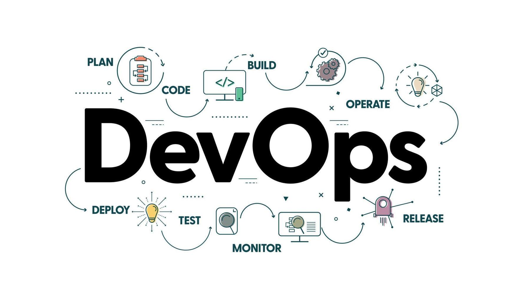

# DevOps-Progress



## Welcome to My DevOps Journey! 🚀

Hello there!

Thank you for visiting my DevOps-Progress repository. This is my personal space where I document and share my journey through the fascinating world of DevOps. Whether you're a seasoned professional or just starting out, I hope you find something valuable here.

## About This Repository

In this repository, you will find:

- **Shell Commands and Scripts**: Handy commands and scripts that I've learned and used.
- **Code Snippets**: Small pieces of code related to DevOps practices.
- **Weekly Updates**: Regular updates on my progress and what I've learned each week.

## Weekly Progress Posts

Every week, I will be sharing a LinkedIn post summarizing my progress along with links to my GitHub and Hashnode blog. Follow me on LinkedIn to stay updated!

### Follow My Journey

- **Hashnode Blog**: [My DevOps Blog](https://hashnode.com/@AdarshN)
- **LinkedIn**: [My LinkedIn Profile](https://www.linkedin.com/in/adarsh-n-7093b4204/)

## Contributing

If you have any suggestions or improvements, feel free to open an issue or a pull request. Let's learn and grow together!

## Acknowledgements

I would like to thank the DevOps community for the immense resources and support available online. Special shoutout to all the mentors and contributors whose work has been instrumental in my learning journey.

---

Happy Learning!

Best regards,  
Adarsh N

# React Native WebRTC News App

This is a **React Native** project that integrates **WebRTC** for real-time communication with remote hardware. The app fetches news data via a WebRTC data channel and renders it using a `NewsFrontPage` component.

## Getting Started

> **Note**: Ensure you have completed the [React Native - Environment Setup](https://reactnative.dev/docs/environment-setup) instructions up to the "Creating a new application" step before proceeding.

### Step 1: Start the Metro Server

First, start **Metro**, the JavaScript _bundler_ that comes with React Native. Run the following command from the _root_ of your React Native project:

```bash
# using npm
npm start

# OR using Yarn
yarn start

```
### Step 2: Start your Application
Let Metro Bundler run in its own terminal. Open a new terminal from the root of your React Native project. Run the following command to start your Android or iOS app:

For Android
```bash
# using npm
npm run android
```
# OR using Yarn

yarn android
For iOS
```bash
# using npm
npm run ios
```
```bash
# OR using Yarn
yarn ios
```

If everything is set up correctly, you should see your app running in the Android Emulator or iOS Simulator shortly.

You can also run the app directly from within Android Studio or Xcode.

### Step 3: Modifying your App
Now that you have successfully run the app, let's modify it.

Open App.tsx in your text editor of choice and edit the necessary lines.

For Android: Press the <kbd>R</kbd> key twice or select "Reload" from the Developer Menu (<kbd>Ctrl</kbd> + <kbd>M</kbd> (on Windows and Linux) or <kbd>Cmd ⌘</kbd> + <kbd>M</kbd> (on macOS)) to see your changes.

For iOS: Hit <kbd>Cmd ⌘</kbd> + <kbd>R</kbd> in your iOS Simulator to reload the app and see your changes.

### WebRTC Integration
The app uses WebRTC to establish a connection with remote hardware. The news data is fetched over a WebRTC data channel and displayed in the app using the NewsFrontPage component.

### Troubleshooting
If you run into issues, please refer to the React Native Troubleshooting page.

## Learn More
To learn more about React Native, take a look at the following resources:


- [React Native Website](https://reactnative.dev) - learn more about React Native.

- [Getting Started](https://reactnative.dev/docs/environment-setup) - an **overview** of React Native and how setup your environment.

- [Learn the Basics](https://reactnative.dev/docs/getting-started) - a **guided tour** of the React Native **basics**.

- [Blog](https://reactnative.dev/blog) - read the latest official React Native **Blog** posts.

- [`@facebook/react-native`](https://github.com/facebook/react-native) - the Open Source; GitHub **repository** for React Native.
